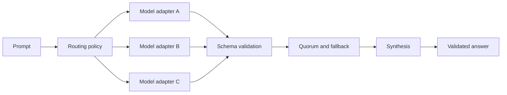

# Fusion Router

[](https://github.com/sakamoto-sann/fusion-router/actions/workflows/ci.yml)
[](https://www.npmjs.com/package/create-fusion-router)
[](LICENSE)
[](https://deno.com/)

**Route one prompt through multiple models, validate every response, and
synthesize a final answer.**

Fusion Router is an open-source Deno framework for model routing. It gives you a
inspectable TypeScript components for parallel fan-out, schema validation,
synthesis, budgets, retries, and fail-closed errors without locking the
application to one provider.

```bash
npx --yes create-fusion-router@latest my-fusion-router
cd my-fusion-router
deno task smoke
```

The smoke task is deterministic and does not spend API credits.


## Why Fusion Router?

A single model is fast and simple. Some tasks benefit from independent responses
and a validated synthesis.

Fusion Router lets an application:

- call several model adapters in parallel;
- reject malformed output before it reaches synthesis;
- select providers using readiness, capability, cost, and fallback policy;
- enforce call and spend budgets;
- use an optional fail-closed buffered audit sink while keeping telemetry
  best-effort;
- run locally through existing CLI or OAuth-backed model sessions.

The routing logic is plain TypeScript. You can inspect it, replace adapters, or
embed the pieces you need.

## Two ways to use it

| Mode                  | Status                        | What it does                                                        |
| --------------------- | ----------------------------- | ------------------------------------------------------------------- |
| Best Route / `direct` | Default, supported path       | Runs validated answer routes and synthesizes a final response       |
| `agent_chat`          | Experimental, explicit opt-in | Runs a bounded multi-role discussion with review and red-team gates |

Best Route does not silently start an agent workflow. Agent Chat stays behind an
explicit runtime opt-in.

## Quickstart

### Create a project

```bash
npx --yes create-fusion-router@latest my-fusion-router
cd my-fusion-router
deno task check
deno task smoke
deno task intake
deno task health
```

### Run the repository examples

```bash
git clone https://github.com/sakamoto-sann/fusion-router.git
cd fusion-router
deno task smoke:v0.1
```

Inspect the installer without changing your machine:

```bash
curl -fsSL https://raw.githubusercontent.com/sakamoto-sann/fusion-router/v0.1.4/install.sh | sh -s -- --dry-run
```

### Try a real local provider

The repository can discover supported local wrappers and existing authenticated
CLI sessions. Real calls require an explicit opt-in.

```bash
cd examples/local-model-dogfood
deno task inventory
deno task auth:status
deno task health
RUN_EXTERNAL_MODEL_DOGFOOD=1 deno task route:once \
  --prompt "Review this API design and return the three biggest risks."
```

Prompts sent through a provider leave the local process. Do not include
credentials or private material unless that provider is approved for it.

## How it works



Each adapter returns a structured response. Invalid responses are excluded. The
router fails closed when it cannot reach the configured quorum or produce a
schema-valid synthesis.

## What is included

- parallel adapter execution and synthesis;
- Zod-validated provider and final outputs;
- provider registry with readiness and auth hints;
- retry, timeout, circuit-breaker, and budget controls;
- adaptive direct-routing and fallback policy;
- process-backed and direct HTTP adapter examples;
- optional OTLP telemetry helpers and a fail-closed Supabase audit-sink
  component;
- deterministic Best Route and Agent Chat demos;
- an experimental bounded AgentRuntime;
- a standalone Hermes plugin for on-demand routing.

## Use it as a library

```ts
import { FusionRouter } from "./router.ts";
import {
  FixtureModelAdapter,
  FixtureSynthesisAdapter,
} from "./examples/v0_1_fixtures.ts";

const router = new FusionRouter({
  modelAdapters: [new FixtureModelAdapter()],
  synthesisAdapter: new FixtureSynthesisAdapter(),
  minSuccessfulAdapters: 1,
  timeoutMs: 1_000,
  routingModeEnvProvider: () => undefined,
});

const result = await router.route(
  "Find the failure modes in this migration plan.",
);

console.log(result.synthesis);
```

See [`examples/basic-direct.ts`](examples/basic-direct.ts) and
[`docs/install.md`](docs/install.md) for complete setup paths.

## Safety boundaries

Fusion Router is routing infrastructure, not a claim that model output is
correct.

- Output schemas catch malformed responses, not factual mistakes.
- Fixture demos do not call the model brands used as fixture labels.
- `agent_chat` is experimental and disabled by default.
- The repository does not provide a production autonomous-agent service.
- It does not perform live Supabase Agent Bus writes or use service-role
  credentials at runtime.
- External model calls are opt-in in the dogfood workspace.

For the threat model and credential rules, read
[`docs/security.md`](docs/security.md). Audit integration is documented in
[`docs/supabase-audit-setup.md`](docs/supabase-audit-setup.md).

## Development

```bash
deno task fmt
deno task check
deno task test
deno task smoke:v0.1
```

Current test coverage includes routing modes, malformed provider output, budget
enforcement, auth failure classification, process cleanup, redaction, Supabase
audit behavior, generated-project smoke tests, and package contents.

## Roadmap

Potential next steps include:

- persistent budget and circuit-breaker state;
- app-level rate limiting and stronger process isolation;
- additional provider adapters and routing evaluations;
- hardening the experimental AgentRuntime.

Today, Best Route / `direct` remains the default supported path; `agent_chat` is
experimental.

## Contributing

Issues and pull requests are welcome. Include tests for behavior changes, run
the development checks above, and keep provider credentials out of commits and
fixtures.

If you build an adapter, evaluation, or integration on top of Fusion Router,
open a discussion or PR so others can try it.

## License

Fusion Router is open source under the [MIT License](LICENSE). You may use,
modify, distribute, sublicense, and sell copies under the MIT terms.
