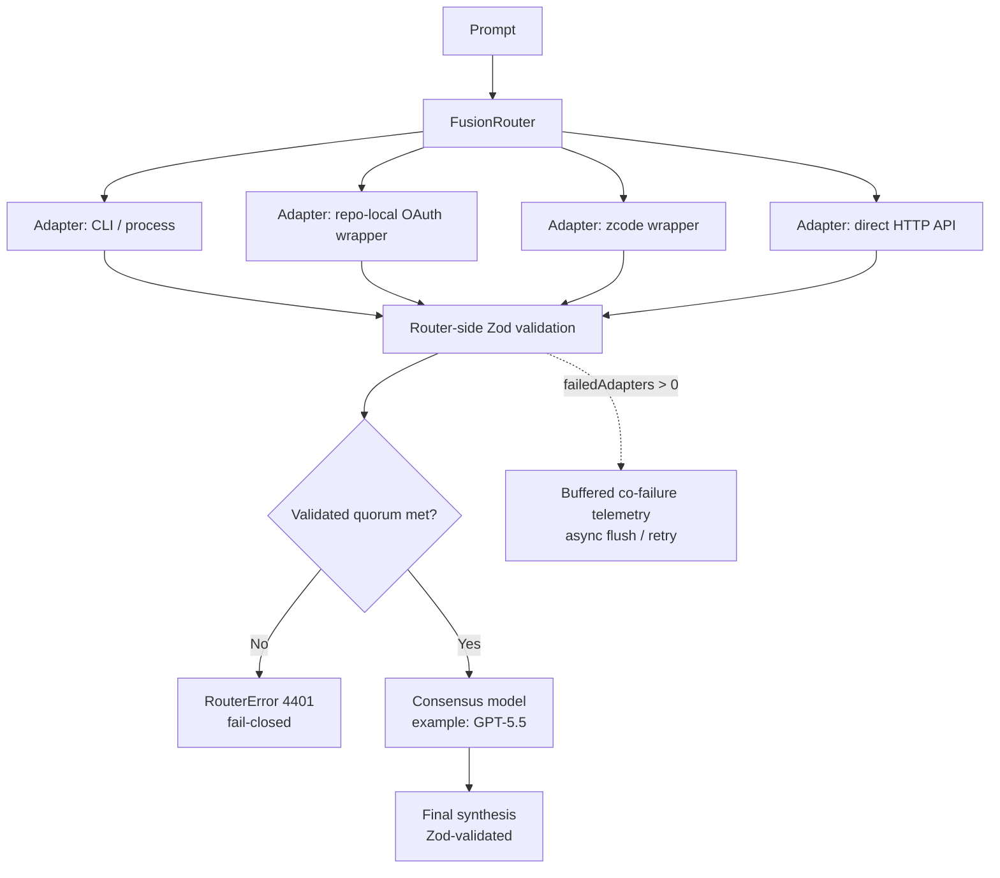

# fusion-router

[](https://github.com/sakamoto-sann/fusion-router/releases)
[](https://deno.com/)
[](#status)
[](#fail-closed-contract)

A small, readable proof-of-concept for a **fusion router** that fans out a
prompt to multiple **CLI / wrapper-backed or direct HTTP LLM adapters**,
validates their outputs with **Zod**, and asks a stronger model to produce the
final consensus.

## Status

> **v0.1 Safe Direct Router integration branch.** The repository now has the
> foundation, Adaptive Direct skeleton, setup generator, and standalone
> AgentChat simulator waves integrated behind conservative offline examples and
> smoke checks. Default direct routing remains compatible; `agent_chat` remains
> recognized but not implemented in production routing.

## v0.1 quickstart

Run the deterministic offline smoke:

```bash
deno task smoke:v0.1
```

Generate the minimal safe-direct setup profile:

```bash
deno task setup -- --profile minimal-direct
```

Try the offline examples:

```bash
deno run examples/basic-direct.ts
deno run examples/adaptive-direct.ts
deno run examples/setup-generated-config.ts
```

Read the release guide and checklist:

- [`docs/release-v0.1.md`](docs/release-v0.1.md)
- [`docs/release-checklist-v0.1.md`](docs/release-checklist-v0.1.md)

v0.1 explicit non-goals:

- no real `agent_chat` runtime
- no hidden fallback
- no Supabase migration changes
- no service-role runtime
- no automatic OAuth/API key setup
- no networked examples by default

## Current PoC status

> **PoC, but no longer mock-only.** This repository ships repo-local OAuth
> wrapper launchers for Codex CLI, Claude Code, Gemini CLI, Grok CLI, plus a
> repo-local `bin/zcode-headless` wrapper lane for GLM. Devin CLI and Cline
> remain process-backed lanes. It also now includes first-class provider-native
> **direct HTTP** adapters for OpenAI and Anthropic, with mocked HTTP tests and
> an explicit `AbortSignal` cancellation contract. Google Gemini / Vertex and
> xAI direct HTTP lanes remain follow-up work.

## Architecture at a glance

The public entrypoint remains `router.ts`, but implementation modules now live
in [`src/`](docs/module-layout.md) so provider registry, Adaptive Direct policy,
installer, `agent_chat`, and persistence work can move independently. Existing
imports from `./router.ts` are preserved by the compatibility barrel. Adaptive
Direct is documented in
[`docs/adaptive-direct-routing.md`](docs/adaptive-direct-routing.md). The setup
surface is documented in [`docs/setup-wizard.md`](docs/setup-wizard.md). The
AgentChat protocol simulator skeleton is documented in
[`docs/agent-chat-protocol.md`](docs/agent-chat-protocol.md).

> Conceptual diagram for the current PoC. The default run still favors local
> CLIs / wrappers, while direct HTTP lanes are opt-in via environment flags.



## What this PoC demonstrates

- Parallel fan-out across multiple CLI / wrapper and direct HTTP adapters
- Zod validation at both the **adapter output** layer and the **final
  consensus** layer
- **Fail-closed** routing boundaries
  - invalid adapter outputs are rejected
  - insufficient validated responses abort consensus
  - invalid synthesis output aborts the request with a structured error
- real process-backed adapter execution through installed CLIs / wrappers
- first-class OpenAI / Anthropic direct HTTP adapters using runtime API keys
- auth/session readiness checks plus optional refresh hooks per adapter
- retry policy with backoff for transient failures / rate limiting
- estimated spend budget guardrails per lane
- Adaptive Direct policy scaffolding for capability, readiness, budget, and safe
  fallback decisions without changing default fan-out behavior
- deterministic setup profiles and config/env guidance for provider, auth,
  transport, routing, persistence, telemetry, and doctor readiness
- standalone AgentChat protocol / simulator skeleton defining roles, limits,
  redaction, and audit milestones without production route integration
- per-adapter circuit breaking after repeated failures
- bounded process-backed adapter execution, even if an adapter ignores
  `AbortSignal`
- direct HTTP cancellation by threading `AbortSignal` into upstream `fetch`
- **Co-failure telemetry** capture with a bounded buffered sink and OTLP/HTTP
  export option
- Support for describing multiple auth surfaces without pretending they are all
  the same thing:
  - provider-native direct APIs that usually use API keys
  - repo-local OAuth CLI wrappers for tools like Codex / Claude Code / Gemini /
    Grok / ZCode
  - direct process-backed tool surfaces like Devin and Cline

## Included surfaces in the PoC

The default router wires real process-backed adapters for these surfaces:

| Surface                         | Auth mode in router | Transport        | Current command                               |
| ------------------------------- | ------------------- | ---------------- | --------------------------------------------- |
| OpenAI (Codex CLI wrapper)      | OAuth               | `processAdapter` | `bin/codex-headless exec ...`                 |
| Anthropic (Claude Code wrapper) | OAuth               | `processAdapter` | `bin/claude-headless -p ...`                  |
| Google (Gemini CLI wrapper)     | OAuth               | `processAdapter` | `bin/gemini-headless -p ...`                  |
| GLM                             | OAuth               | `zcodeWrapper`   | `bin/zcode-headless --mode plan --prompt ...` |
| xAI (Grok CLI wrapper)          | OAuth               | `processAdapter` | `bin/grok-headless -p ...`                    |
| Cognition (Devin)               | session-backed      | `processAdapter` | `devin -p`                                    |
| Cline                           | session-backed      | `processAdapter` | `cline --json`                                |

## Provider-native direct API surfaces

Direct HTTP adapters use runtime-loaded API keys and bypass local CLIs. They are
opt-in so the default smoke run does not accidentally spend API budget.

| Provider                   | Native auth shape                             | Status in this repo                          |
| -------------------------- | --------------------------------------------- | -------------------------------------------- |
| OpenAI API                 | API key (`OPENAI_API_KEY`)                    | first-class `directHttp` adapter + synthesis |
| Anthropic API              | API key (`ANTHROPIC_API_KEY`)                 | first-class `directHttp` adapter             |
| Google Gemini / Vertex API | API key (`GEMINI_API_KEY` / `GOOGLE_API_KEY`) | follow-up                                    |
| xAI API                    | API key (`XAI_API_KEY`)                       | follow-up                                    |

Direct HTTP modes:

```bash
# Add OpenAI / Anthropic direct HTTP lanes alongside CLI / wrapper lanes when
# their API keys are present.
FUSION_ROUTER_ENABLE_DIRECT_HTTP=1 deno task run

# Run without local CLIs. Export an OpenAI API key in your shell first because
# the direct-only synthesis stage currently uses OpenAI Chat Completions.
FUSION_ROUTER_DIRECT_HTTP_ONLY=1 deno task run
```

`authMode` and `transport` are not just table labels anymore: the router now
maps configured readiness checks, optional refresh hooks, wrapper-specific
env/token plumbing, retries, estimated budget guardrails, and circuit-breaking
behavior into process-backed adapters. The GLM lane stays isolated behind
`zcodeWrapper` via `bin/zcode-headless`; Codex / Claude / Gemini / Grok now
default to repo-local wrapper launchers instead of calling the upstream CLIs
directly. Direct HTTP lanes use `transport: directHttp`, runtime-loaded API
keys, mock-testable `fetch` injection, and provider-specific response parsers.

## Wrapper commands

Each repo-local wrapper exposes the same basic control surface:

| Wrapper               | `status`                                                                 | `login`                                                                                        | Notes                                                                   |
| --------------------- | ------------------------------------------------------------------------ | ---------------------------------------------------------------------------------------------- | ----------------------------------------------------------------------- |
| `bin/codex-headless`  | `codex login status`                                                     | `codex login --device-auth` (default)                                                          | OAuth / ChatGPT-backed Codex session                                    |
| `bin/claude-headless` | `claude auth status`                                                     | `claude auth login --claudeai` (default)                                                       | `claude auth login --console` remains available if you want API billing |
| `bin/gemini-headless` | checks `~/.gemini/settings.json` for `selectedAuthType = oauth-personal` | launches interactive `gemini` with API-key env unset so you can choose **Sign in with Google** | Google OAuth path is real, but still browser-driven                     |
| `bin/grok-headless`   | checks `~/.grok/auth.json` and token expiry                              | `grok login --oauth` (default)                                                                 | Uses Grok browser / OIDC login                                          |
| `bin/zcode-headless`  | `doctor`                                                                 | n/a                                                                                            | Requires `~/.zcode/cli/config.json`                                     |

## Fail-closed contract

This PoC does **not** silently continue into a fake consensus when the validated
quorum is missing.

If the router cannot gather enough validated adapter outputs, it throws a
structured `RouterError` with status `4401`.

Telemetry is **best effort** on the request path, but no longer direct-inline:
failed adapter telemetry is enqueued into a bounded in-memory buffer and flushed
asynchronously. Sink failures are logged/retried without blocking consensus. The
shipped code includes an OTLP/HTTP adapter so correlated failures can still be
forwarded to OpenTelemetry-compatible backends.

The buffering layer is transport-agnostic: `createBufferedBatchSink<T>()` owns
the ring buffer, batch selection, retry/backoff, and shutdown drain while
callers inject the transport-specific batch handler. Concurrent sink calls are
serialized through flush chaining, preventing flush / RPC storms. `must_accept`
failures propagate to the caller and do not silently degrade into best-effort
delivery. BufferedBatchSink uses O(1) normal enqueue and overflow bookkeeping
paths; normal batch selection and recovery rebuild paths are bounded O(N) over
`maxQueueSize`. Rollback/requeue/rebuild paths are only used for
recovery/failure handling. Timers are unref'ed best-effort so telemetry timers
do not keep the process alive. Telemetry and audit sinks use the same primitive
with different semantics:

| Use case              | Overflow policy | Delivery mode | Failure semantics                                      |
| --------------------- | --------------- | ------------- | ------------------------------------------------------ |
| Co-failure telemetry  | `drop_oldest`   | `best_effort` | preserve newest signals; never block consensus         |
| Workflow access audit | `fail_closed`   | `must_accept` | reject when the audit event cannot be accepted/drained |

Buffered telemetry defaults:

| Setting              |       Default | Env override                                                                        | Hard cap | Notes                                     |
| -------------------- | ------------: | ----------------------------------------------------------------------------------- | -------: | ----------------------------------------- |
| Max queue size       |          1000 | `FUSION_ROUTER_TELEMETRY_MAX_QUEUE`                                                 |    10000 | queue is bounded to avoid OOM             |
| Overflow policy      |   drop oldest | n/a                                                                                 |      n/a | newest co-failure events are preserved    |
| Batch size           |            30 | `FUSION_ROUTER_TELEMETRY_MAX_BATCH`                                                 |      500 | flushes at most this many per pass        |
| Flush interval       |        500 ms | `FUSION_ROUTER_TELEMETRY_FLUSH_INTERVAL_MS`                                         | 60000 ms | background timer is unref'd               |
| Max attempts         |             5 | `FUSION_ROUTER_TELEMETRY_MAX_ATTEMPTS`                                              |       10 | exhausted events are dropped              |
| Backoff              | 250 ms → 30 s | `FUSION_ROUTER_TELEMETRY_BASE_BACKOFF_MS`, `FUSION_ROUTER_TELEMETRY_MAX_BACKOFF_MS` | 60s/300s | exponential retry after collector failure |
| Drain budget         |        200 ms | `FUSION_ROUTER_TELEMETRY_DRAIN_MS`                                                  |  5000 ms | used by explicit shutdown drain           |
| OTLP request timeout |        500 ms | `FUSION_ROUTER_TELEMETRY_HTTP_TIMEOUT_MS`                                           | 30000 ms | aborts slow collectors                    |
| Unload hook          |       enabled | `FUSION_ROUTER_TELEMETRY_DISABLE_UNLOAD_HOOK=1`                                     |      n/a | close removes the registered listener     |

`FusionRouter.flushTelemetry()` and `FusionRouter.closeTelemetry()` provide an
explicit drain API. The default `deno task run` path calls `closeTelemetry()` in
`finally`, and the buffered sink also registers a best-effort `unload` hook.
Shutdown `force: true` ignores backoff eligibility for one final delivery pass;
entries that still fail during that pass are dropped rather than immediately
requeued, which bounds shutdown traffic and prevents retry storms.

Phase 2 adds the real Supabase audit boundary while keeping the Phase 1 sink API
intact:

- `createSupabaseAuditHandler()` calls
  `/rest/v1/rpc/insert_workflow_access_audit_batch` with a user/session JWT and
  anon key only; runtime code never reads service-role credentials.
- The handler shapes client payloads to `event_type`, `actor_type`,
  `workflow_id`, `route`, `decision`, `reason`, and `metadata` only. It never
  sends `org_id`, `actor_id`, or `created_at`; those are injected by the DB RPC.
- `supabase/migrations/20260701130000_workflow_access_audit.sql` creates the
  append-only `workflow_access_audit` table, enables RLS, revokes direct anon /
  authenticated table access, and grants authenticated users only `EXECUTE` on
  the RPC.
- `deno task doctor` fails closed if a Supabase service-role-like environment
  variable is present. Missing Supabase URL / anon key remains informational
  unless only one side is configured, in which case doctor warns about the
  incomplete audit RPC config.

Phase 2.5 adds setup/operator documentation only. Use
[`docs/supabase-audit-setup.md`](docs/supabase-audit-setup.md) for migration,
JWT claim, env, privilege-model, and doctor guidance, then use
[`docs/supabase-audit-checklist.md`](docs/supabase-audit-checklist.md) for the
manual verification checklist after applying the migration. `.env.example` keeps
runtime Supabase audit values empty and documents that service-role credentials
are migration/admin-only, never router runtime config.

Phase 3 now has a minimal routing-mode parser, config-loader boundary, and
sanitized routing decision summary.
[`docs/routing-mode-design.md`](docs/routing-mode-design.md) remains the source
for future runtime work; [`docs/module-layout.md`](docs/module-layout.md)
documents the Foundation Wave module split and public export preservation. The
implemented routing slices recognize `direct` and `agent_chat`, load an optional
`fusion-router.config.json` skeleton with `routing.mode`, resolve mode
precedence as request metadata > config file > `FUSION_ROUTER_MODE` > default,
expose a safe `{ mode, source, implemented }` decision summary, keep `direct` on
the existing router flow, and fail closed before adapter execution for
`agent_chat` because the agent-chat runtime is intentionally not implemented
yet. `deno task doctor` reports config/env routing status, config-vs-env
precedence, effective mode readiness, and the recognized-but-not-implemented
`agent_chat` status without printing raw invalid values or config contents.

Adaptive Direct adds a safe policy skeleton on top of `direct` mode without
changing default behavior. `ProviderCapabilityRegistry` describes provider /
model auth, transport, structured JSON, synthesis, cost, latency, reliability,
and enablement metadata. `DirectRoutingPolicy` can reject disabled, unready, or
over-budget candidates and returns selected adapters, rejection reasons, a
synthesis candidate, a budget estimate, and an explicit fallback-policy label.
Fallback remains a policy classification, not silent success: validation
mismatch, malformed provider responses, consensus validation failure, invalid
routing modes, `agent_chat` not implemented, audit failure, and provider
identity mismatches never fall back to an unsafe provider. See
[`docs/adaptive-direct-routing.md`](docs/adaptive-direct-routing.md).

The setup generator creates deterministic `fusion-router.config.json` candidates
and empty env placeholder guidance without writing secrets. Use
`deno task setup
-- --profile minimal-direct` for dry-run output or add
`--write` to write a config path. Built-in profiles cover `minimal-direct`,
OpenAI / Anthropic direct HTTP, CLI OAuth wrappers, Adaptive Direct, and
Supabase audit RPC. Setup never runs OAuth login, validates live credentials,
stores API keys, emits service-role keys, or implements local JSONL persistence.
See [`docs/setup-wizard.md`](docs/setup-wizard.md).

The AgentChat skeleton now defines protocol roles, limits, transcript redaction,
and audit milestone taxonomy, plus a deterministic standalone simulator:

```bash
deno run examples/agent-chat-simulator.ts
```

This is not production routing. `agent_chat` remains recognized but not
implemented in `FusionRouter.route()` and still fails closed before adapter
execution. The simulator makes no LLM, network, process, tool, persistence, or
Supabase calls. See
[`docs/agent-chat-protocol.md`](docs/agent-chat-protocol.md).

Example config:

```json
{
  "routing": {
    "mode": "direct"
  }
}
```

Cancellation is transport-specific:

- CLI / wrapper lanes are bounded by process timeout, `SIGTERM`, and listener /
  timer cleanup in `runProcess`.
- Direct HTTP lanes must pass the router's `AbortSignal` into upstream
  `fetch(..., { signal })`. Tests assert that omission would prevent timeout
  cancellation from reaching the provider-client boundary.

## Local run

This repo uses repo-managed Deno imports in `deno.json` plus local CLI
execution. Prefer the checked-in tasks:

```bash
deno task check
deno task lint
deno task test
deno task doctor
deno task setup -- --profile minimal-direct
deno task run
```

The run task expands to:

```bash
deno run --allow-run --allow-read --allow-write --allow-env --allow-net router.ts
```

## Dependency pinning

External Deno imports are intentionally centralized in `deno.json` and pinned in
`deno.lock`. Do **not** import `https://...` specifiers directly from source
files.

Dependency update workflow:

1. Edit the relevant alias in `deno.json`.
2. Refresh the lockfile:

   ```bash
   deno task lock
   ```

3. Re-run verification:

   ```bash
   deno task check
   deno task lock:check
   deno task lint
   deno task test
   ```

## Next production steps

1. Install / authenticate the required CLIs on each target host (Claude Code,
   Gemini CLI, Cline, and `zcode` may still fail if the local session is missing
   or invalid).
2. Supply a valid ZCode model config on hosts that should execute the GLM lane.
   The minimal working shape on this host is:

   ```json
   {
     "provider": {
       "zai": {
         "name": "zai",
         "options": {
           "baseURL": "https://api.z.ai/api/paas"
         },
         "models": {
           "glm-5.2": {
             "name": "glm-5.2"
           },
           "glm-4.7": {
             "name": "glm-4.7"
           }
         }
       }
     },
     "model": {
       "main": "zai/glm-5.2",
       "lite": "zai/glm-4.7"
     }
   }
   ```

   Save that as `~/.zcode/cli/config.json`.
3. Add Google Gemini / Vertex and xAI direct HTTP adapters.
4. Persist budget / circuit-breaker state outside process memory.
5. Add CI smoke jobs that exercise each installed CLI lane and each mocked
   direct HTTP lane separately.
6. Add vendor-specific OTLP/Honeycomb/Datadog deployment examples and
   dashboards.
7. Persist buffered telemetry counters to a metrics surface if operators need
   queue/drop dashboards.
