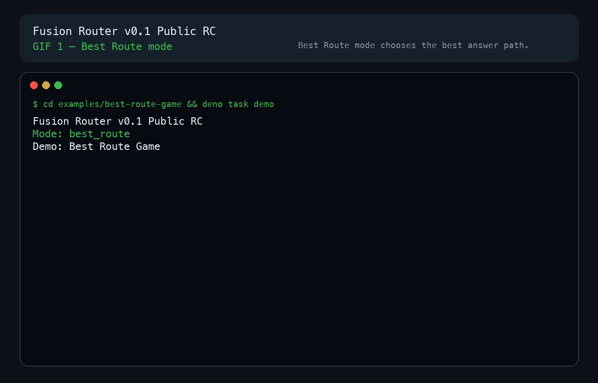
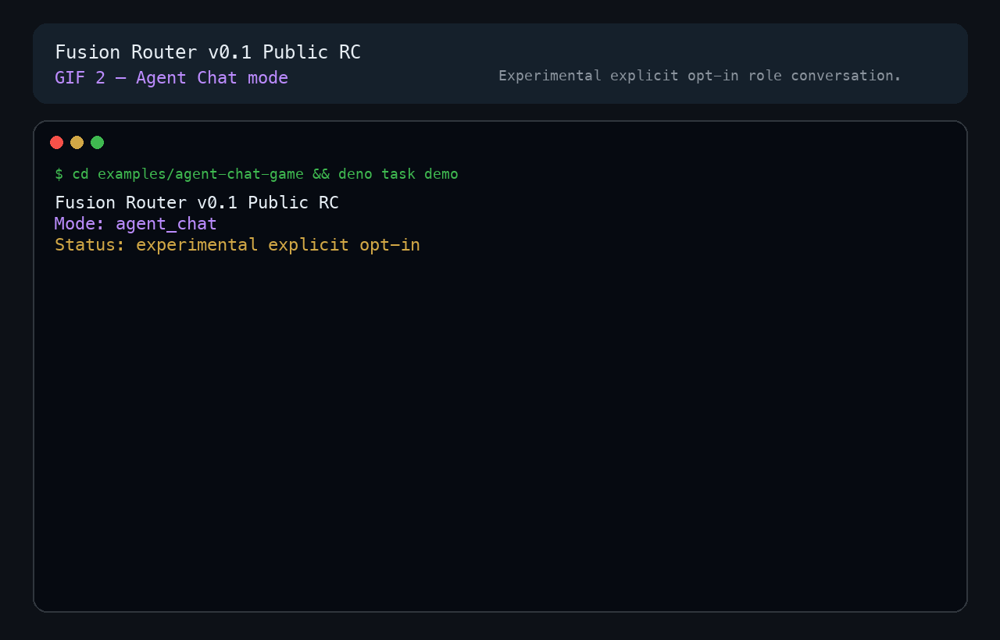

# Fusion Router

Source-available Deno routing framework for best-answer routing, with optional
experimental agent chat.

## Quickstart

```bash
npx --yes create-fusion-router@latest my-fusion-router-demo
cd my-fusion-router-demo
deno task smoke
```

NPX is not the goal. `deno task smoke` is deterministic fixture-only and does
**not** call a real external provider API. Public Product Hunt/X launch requires
local real-model dogfood first: the user must personally confirm that Fusion
Router can discover and invoke the models actually available from this machine's
existing OAuth, wrapper, CLI session, or explicitly selected env fallback setup.
Generic API-key env fallback is private/manual only and is not the primary
launch proof.

Repo-local dogfood workspace:

```bash
cd examples/local-model-dogfood
deno task inventory
deno task auth:status
deno task health
RUN_EXTERNAL_MODEL_DOGFOOD=1 deno task route:once --prompt "Review this README for risky claims."
RUN_EXTERNAL_MODEL_DOGFOOD=1 deno task best-route --prompt "Choose the safest launch copy."
RUN_EXTERNAL_MODEL_DOGFOOD=1 RUN_EXPERIMENTAL_AGENT_CHAT=1 deno task agent-chat --prompt "Review this launch plan."
```

Best Route/direct remains the production-ready best-answer routing path.
`agent_chat` remains experimental explicit opt-in only.

Dry-run the installer without changing the machine:

```bash
curl -fsSL https://raw.githubusercontent.com/sakamoto-sann/fusion-router/v0.1.4/install.sh | sh -s -- --dry-run
```

## Demos

### GIF 1 — Best Route mode

Best Route mode chooses the best answer path. It does not run the Agent Chat
conversation loop.



MP4 fallback:
[Best Route demo](docs/assets/launch/fusion-router-best-route-game.mp4)

### GIF 2 — Agent Chat mode

Agent Chat mode is experimental and explicit opt-in. It is separate from Best
Route mode.



MP4 fallback:
[Agent Chat demo](docs/assets/launch/fusion-router-agent-chat-game.mp4)

## Modes

| Mode                | Status                       | Purpose                      |
| ------------------- | ---------------------------- | ---------------------------- |
| Best Route / direct | Production-ready path        | Best-answer routing          |
| agent_chat          | Experimental explicit opt-in | Multi-role conversation demo |

Agent Chat and Commander contracts do not change default direct routing.

## Local checks

```bash
deno task fmt
deno task check
deno task test
deno task smoke:v0.1
```

## Links

- npm: https://www.npmjs.com/package/create-fusion-router
- release: https://github.com/sakamoto-sann/fusion-router/releases/tag/v0.1.4
- launch assets: [docs/launch/](docs/launch/)
- internal dogfood QA:
  [docs/dogfood/manual-qa-runbook.md](docs/dogfood/manual-qa-runbook.md)
- Hermes Agent on-demand integration:
  [integrations/hermes/](integrations/hermes/)
- examples: [examples/](examples/)
- security notes: [docs/security.md](docs/security.md)

## License and boundaries

Fusion Router is Source-Available Non-Commercial. It is not an open source
license.

Commercial, production, hosted-service/SaaS/API, redistribution, sublicensing,
integration, derivative commercialization, or competing product/service use
requires prior written permission. See [LICENSE](LICENSE).

No production autonomous runtime, no live Supabase Agent Bus runtime writes, and
no service-role runtime.
