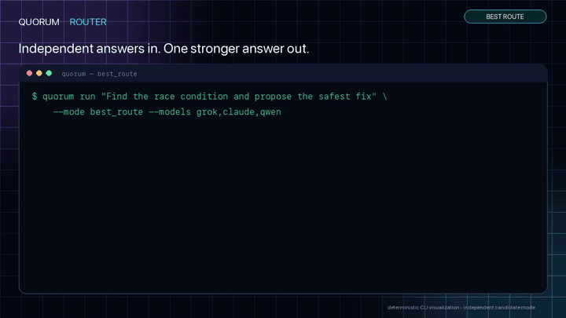

# QuorumRouter

Source-available Deno control plane for fail-closed best-answer routing and
SafeLoop-authorized multi-role agent execution.

## Quickstart

```bash
npx --yes github:sakamoto-sann/quorum-router#main my-quorum-router
cd my-quorum-router
deno task smoke
```

The source-backed NPX command above works directly from `main`; no npm registry
publication is required. `deno task smoke` is deterministic fixture-only and
does **not** call a real external provider API. Public Product Hunt/X launch
requires local real-model dogfood first: the user must personally confirm that
QuorumRouter can discover and invoke the models actually available from this
machine's existing OAuth, wrapper, CLI session, or explicitly selected env
fallback setup. Generic API-key env fallback is private/manual only and is not
the primary launch proof.

Repo-local dogfood workspace:

```bash
cd examples/local-model-dogfood
deno task inventory
deno task auth:status
deno task health
RUN_EXTERNAL_MODEL_DOGFOOD=1 deno task route:once --prompt "Review this README for risky claims."
RUN_EXTERNAL_MODEL_DOGFOOD=1 deno task best-route --prompt "Choose the safest launch copy."
RUN_EXTERNAL_MODEL_DOGFOOD=1 RUN_EXPERIMENTAL_AGENT_CHAT=1 deno task agent-chat --prompt "Review this launch plan."
```

Best Route/direct remains the production best-answer path. Conversation-only
Agent Chat is explicit opt-in. SafeLoop-backed Agent Chat provides a bounded
production repository execution slice. Its coder emits structured proposals, and
an injected SafeLoop client is the sole execution authority. The current real
SafeLoop execute-request API requires a distinct-actor approval bound to the
exact canonical digest for every repo or shell write. QuorumRouter does not
approve or sign policy and accepts only a strictly verified SafeLoop v1 receipt.

Dry-run the installer without changing the machine:

```bash
curl -fsSL https://raw.githubusercontent.com/sakamoto-sann/quorum-router/v0.1.4/install.sh | sh -s -- --dry-run
```

## Demo 1 — Best Route

Best Route asks models for **independent candidates**. They do not talk to each
other. QuorumRouter compares the answers, explains the selection, and
synthesizes the strongest final answer.



[Watch the 15-second Best Route MP4](docs/assets/launch/quorum-router-best-route.mp4)

```bash
quorum run "Find the race condition and propose the safest fix" \
  --mode best_route --models grok,claude,qwen
```

## Demo 2 — Agent Chat

Agent Chat is intentionally different: **Grok and GLM share conversation context
and respond to each other over multiple rounds**. The CLI log shows
disagreement, a counterargument, a changed strategy, a follow-up challenge, and
convergence.


[Watch the 26-second Agent Chat MP4](docs/assets/launch/quorum-router-agent-chat.mp4)

```bash
quorum run "Debate the best move from this position" \
  --mode agent_chat --models grok,glm --max-rounds 6
```

Both recordings are deterministic CLI visualizations and do not claim live
external model/API traffic. SafeLoop execution is a separate authorization
boundary; it is not a substitute for the inter-model conversation shown here.

## Modes

| Mode                      | Status                    | Purpose                            |
| ------------------------- | ------------------------- | ---------------------------------- |
| Best Route / direct       | Production-ready path     | Best-answer routing                |
| agent_chat (conversation) | Explicit read-only mode   | Multi-role review conversation     |
| agent_chat (execution)    | Production, bounded slice | SafeLoop-authorized repo execution |

Agent Chat and Commander contracts do not change default direct routing.

## Local checks

```bash
deno task fmt
deno task check
deno task test
deno task smoke:v0.1
```

## Links

- source installer: `npx --yes github:sakamoto-sann/quorum-router#main`
- release: https://github.com/sakamoto-sann/quorum-router/releases/tag/v0.1.4
- launch assets: [docs/launch/](docs/launch/)
- internal dogfood QA:
  [docs/dogfood/manual-qa-runbook.md](docs/dogfood/manual-qa-runbook.md)
- Hermes Agent on-demand integration:
  [integrations/hermes/](integrations/hermes/)
- examples: [examples/](examples/)
- SafeLoop AgentRuntime setup: [docs/agent-runtime.md](docs/agent-runtime.md)
- security notes: [docs/security.md](docs/security.md)

## License and boundaries

QuorumRouter is Source-Available Non-Commercial. It is not an open source
license.

Commercial, production, hosted-service/SaaS/API, redistribution, sublicensing,
integration, derivative commercialization, or competing product/service use
requires prior written permission. See [LICENSE](LICENSE).

QuorumRouter does not contain an autonomous executor, policy engine, audit WAL,
artifact verifier, or rollback engine. Execution receipts and artifact evidence
must come from the injected SafeLoop authority. GitHub, database, external API,
release, policy, and credential mutations remain unsupported. Repo and shell
mutations are available only through the SafeLoop execute-request authority and
the confined structured-action worker. There are no live Supabase Agent Bus
runtime writes and no service-role runtime.
