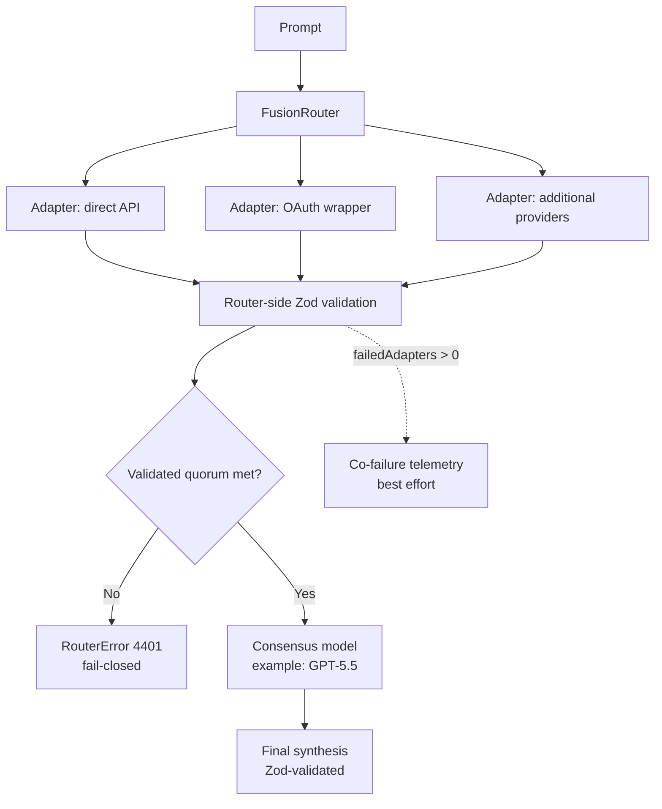

# fusion-router

[](https://github.com/sakamoto-sann/fusion-router/releases)
[](https://deno.com/)
[](#status)
[](#fail-closed-contract)

A small, readable proof-of-concept for a **fusion router** that fans out a prompt to multiple LLM adapters, validates their outputs with **Zod**, and asks a stronger model (for example **GPT-5.5**) to produce the final consensus.

## Status

> **PoC only.** This repository is intentionally lightweight and readable.
> For production use, you still need to implement real provider API adapters (or wrapper clients), authentication flows, retries, quotas, cost controls, and persistent telemetry sinks.

## Architecture at a glance

> Conceptual diagram for the current **mock-adapter PoC**. The repository does not yet ship real provider API clients.



## What this PoC demonstrates

- Parallel fan-out across multiple model adapters
- Zod validation at both the **adapter output** layer and the **final consensus** layer
- **Fail-closed** routing boundaries
  - invalid adapter outputs are rejected
  - insufficient validated responses abort consensus
  - invalid synthesis output aborts the request with a structured error
- bounded adapter execution, even if an adapter ignores `AbortSignal`
- **Co-failure telemetry** capture so correlated provider failures can be logged/observed
- Support for describing both:
  - direct provider API integrations
  - OAuth-backed wrapper clients such as a `zcode`-style bridge

## Included surfaces in the PoC

The demo configuration includes examples for these adapter shapes:

| Surface | Example auth | Example transport |
|---|---|---|
| OpenAI | API key | direct API |
| Anthropic | API key | direct API |
| DeepSeek | API key | direct API |
| GLM | OAuth | `zcodeWrapper` |
| xAI (Grok) | OAuth | `zcodeWrapper` |
| Google (Gemini) | OAuth | `zcodeWrapper` |
| Anthropic (Claude) | OAuth | `zcodeWrapper` |
| Cognition (Devin) | OAuth | `zcodeWrapper` |
| Cline | OAuth | `zcodeWrapper` |

These are **architecture placeholders** in this repo's current form. The shipped code uses mock adapters so the structure stays easy to read.

## Fail-closed contract

This PoC does **not** silently continue into a fake consensus when the validated quorum is missing.

If the router cannot gather enough validated adapter outputs, it throws a structured `RouterError` with status `4401`.

Telemetry is **best effort** in this PoC: telemetry sink failures are logged, but they do not block the main request path.

## Local run

This repo uses a remote Deno import for Zod, so run it with Deno:

```bash
deno run --allow-net router.ts
```

## Next production steps

1. Implement real adapters for OpenAI / Anthropic / DeepSeek / xAI / Google / GLM / wrapper clients
2. Map OAuth session refresh and wrapper-specific token plumbing into each adapter
3. Send co-failure telemetry to a real sink (OpenTelemetry, Honeycomb, Datadog, etc.)
4. Add retries, budgets, rate-limit handling, and circuit breaking
5. Add tests for malformed provider responses, quorum failure, and synthesis validation failure
