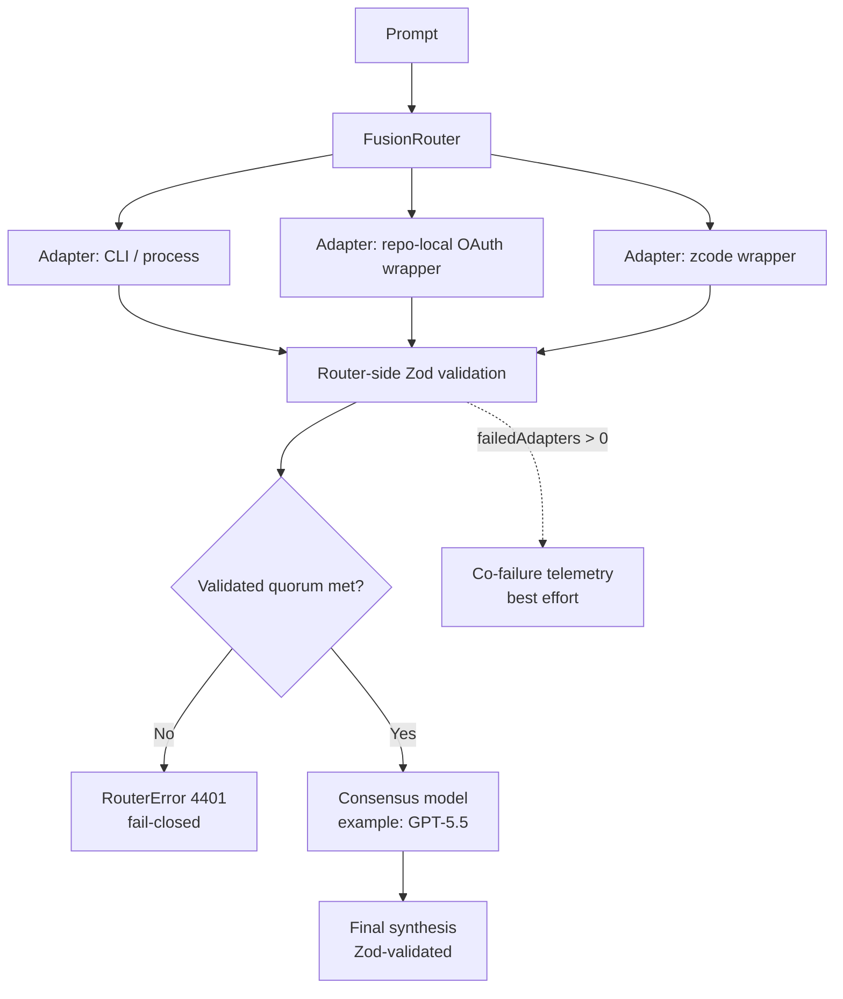

# fusion-router

[](https://github.com/sakamoto-sann/fusion-router/releases)
[](https://deno.com/)
[](#status)
[](#fail-closed-contract)

A small, readable proof-of-concept for a **fusion router** that fans out a
prompt to multiple **CLI / wrapper-backed LLM adapters**, validates their
outputs with **Zod**, and asks a stronger model (here **Codex / GPT-5.5**) to
produce the final consensus.

## Status

> **PoC, but no longer mock-only.** This repository now ships repo-local OAuth
> wrapper launchers for Codex CLI, Claude Code, Gemini CLI, Grok CLI, plus a
> repo-local `bin/zcode-headless` wrapper lane for GLM. Devin CLI and Cline
> remain direct process-backed lanes. Live success still depends on each host
> having the right CLI installed and authenticated. Provider-native direct API
> surfaces (OpenAI / Anthropic / Google / xAI via API key) are documented here,
> but are **not yet modeled as first-class adapters in this repo**.

## Architecture at a glance

> Conceptual diagram for the current **process-backed PoC**. The repository
> favors local CLIs / wrappers over direct provider SDK calls.



## What this PoC demonstrates

- Parallel fan-out across multiple CLI / wrapper adapters
- Zod validation at both the **adapter output** layer and the **final
  consensus** layer
- **Fail-closed** routing boundaries
  - invalid adapter outputs are rejected
  - insufficient validated responses abort consensus
  - invalid synthesis output aborts the request with a structured error
- real process-backed adapter execution through installed CLIs / wrappers
- auth/session readiness checks plus optional refresh hooks per adapter
- retry policy with backoff for transient failures / rate limiting
- estimated spend budget guardrails per lane
- per-adapter circuit breaking after repeated failures
- bounded adapter execution, even if an adapter ignores `AbortSignal`
- **Co-failure telemetry** capture with an OTLP/HTTP log sink option
- Support for describing multiple auth surfaces without pretending they are all
  the same thing:
  - provider-native direct APIs that usually use API keys
  - repo-local OAuth CLI wrappers for tools like Codex / Claude Code / Gemini /
    Grok / ZCode
  - direct process-backed tool surfaces like Devin and Cline

## Included surfaces in the PoC

The default router wires real process-backed adapters for these surfaces:

| Surface                         | Auth mode in router | Transport        | Current command                               |
| ------------------------------- | ------------------- | ---------------- | --------------------------------------------- |
| OpenAI (Codex CLI wrapper)      | OAuth               | `processAdapter` | `bin/codex-headless exec ...`                 |
| Anthropic (Claude Code wrapper) | OAuth               | `processAdapter` | `bin/claude-headless -p ...`                  |
| Google (Gemini CLI wrapper)     | OAuth               | `processAdapter` | `bin/gemini-headless -p ...`                  |
| GLM                             | OAuth               | `zcodeWrapper`   | `bin/zcode-headless --mode plan --prompt ...` |
| xAI (Grok CLI wrapper)          | OAuth               | `processAdapter` | `bin/grok-headless -p ...`                    |
| Cognition (Devin)               | session-backed      | `processAdapter` | `devin -p`                                    |
| Cline                           | session-backed      | `processAdapter` | `cline --json`                                |

## Provider-native direct API surfaces

These are **real provider auth surfaces**, but this repo does **not** implement
them as adapters yet:

| Provider                   | Native auth shape                             | Status in this repo |
| -------------------------- | --------------------------------------------- | ------------------- |
| OpenAI API                 | API key (`OPENAI_API_KEY`)                    | documented only     |
| Anthropic API              | API key (`ANTHROPIC_API_KEY`)                 | documented only     |
| Google Gemini / Vertex API | API key (`GEMINI_API_KEY` / `GOOGLE_API_KEY`) | documented only     |
| xAI API                    | API key (`XAI_API_KEY`)                       | documented only     |

`authMode` and `transport` are not just table labels anymore: the router now
maps configured readiness checks, optional refresh hooks, wrapper-specific
env/token plumbing, retries, estimated budget guardrails, and circuit-breaking
behavior into process-backed adapters. The GLM lane stays isolated behind
`zcodeWrapper` via `bin/zcode-headless`; Codex / Claude / Gemini / Grok now
default to repo-local wrapper launchers instead of calling the upstream CLIs
directly.

## Wrapper commands

Each repo-local wrapper exposes the same basic control surface:

| Wrapper               | `status`                                                                 | `login`                                                                                        | Notes                                                                   |
| --------------------- | ------------------------------------------------------------------------ | ---------------------------------------------------------------------------------------------- | ----------------------------------------------------------------------- |
| `bin/codex-headless`  | `codex login status`                                                     | `codex login --device-auth` (default)                                                          | OAuth / ChatGPT-backed Codex session                                    |
| `bin/claude-headless` | `claude auth status`                                                     | `claude auth login --claudeai` (default)                                                       | `claude auth login --console` remains available if you want API billing |
| `bin/gemini-headless` | checks `~/.gemini/settings.json` for `selectedAuthType = oauth-personal` | launches interactive `gemini` with API-key env unset so you can choose **Sign in with Google** | Google OAuth path is real, but still browser-driven                     |
| `bin/grok-headless`   | checks `~/.grok/auth.json` and token expiry                              | `grok login --oauth` (default)                                                                 | Uses Grok browser / OIDC login                                          |
| `bin/zcode-headless`  | `doctor`                                                                 | n/a                                                                                            | Requires `~/.zcode/cli/config.json`                                     |

## Fail-closed contract

This PoC does **not** silently continue into a fake consensus when the validated
quorum is missing.

If the router cannot gather enough validated adapter outputs, it throws a
structured `RouterError` with status `4401`.

Telemetry is still **best effort** on the request path: sink failures are
logged, but they do not block the main request. The shipped code includes an
OTLP/HTTP log sink so correlated failures can be forwarded to
OpenTelemetry-compatible backends.

## Local run

This repo uses repo-managed Deno imports in `deno.json` plus local CLI
execution. Prefer the checked-in tasks:

```bash
deno task check
deno task lint
deno task test
deno task run
```

The run task expands to:

```bash
deno run --allow-run --allow-read --allow-write --allow-env --allow-net router.ts
```

## Dependency pinning

External Deno imports are intentionally centralized in `deno.json` and pinned in
`deno.lock`. Do **not** import `https://...` specifiers directly from source
files.

Dependency update workflow:

1. Edit the relevant alias in `deno.json`.
2. Refresh the lockfile:

   ```bash
   deno task lock
   ```

3. Re-run verification:

   ```bash
   deno task check
   deno task lock:check
   deno task lint
   deno task test
   ```

## Next production steps

1. Install / authenticate the required CLIs on each target host (Claude Code,
   Gemini CLI, Cline, and `zcode` may still fail if the local session is missing
   or invalid)
2. Supply a valid ZCode model config on hosts that should execute the GLM lane.
   The minimal working shape on this host is:

   ```json
   {
     "provider": {
       "zai": {
         "name": "zai",
         "options": {
           "baseURL": "https://api.z.ai/api/paas"
         },
         "models": {
           "glm-5.2": {
             "name": "glm-5.2"
           },
           "glm-4.7": {
             "name": "glm-4.7"
           }
         }
       }
     },
     "model": {
       "main": "zai/glm-5.2",
       "lite": "zai/glm-4.7"
     }
   }
   ```

   Save that as `~/.zcode/cli/config.json`.
3. Persist budget / circuit-breaker state outside process memory
4. Add CI smoke jobs that exercise each installed CLI lane separately
5. Add vendor-specific OTLP/Honeycomb/Datadog deployment examples and dashboards
